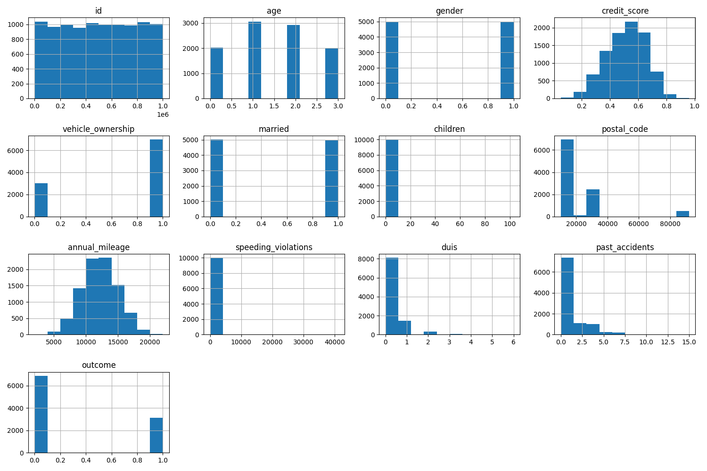
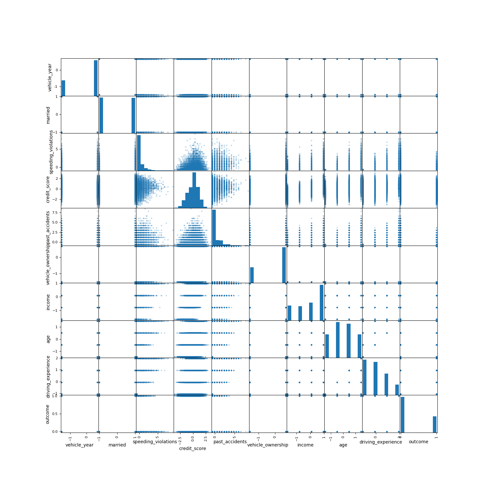
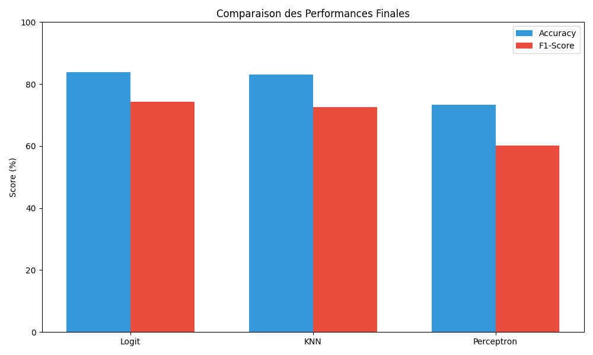

# Projet de Classification Supervisée
## Prédiction de Sinistres Assurance Automobile

**Objectif :** Prédire la probabilité de sinistre (`outcome`).
**Dataset :** 10 000 entrées, 18 variables.

---

# 1. Analyse et Nettoyage des Données

- Suppression des outliers (`speeding_violations > 100`).
- Suppression des variables `id` et `postal_code`.

*Analyse : Distributions saines après nettoyage.*

---

# 2. Préparation des Données

- **Imputation :** Médiane (numérique) et Mode (qualitatif).
- **Encodage :** Mapping manuel pour préserver la hiérarchie.
- **Normalisation :** `StandardScaler` (équilibrage des échelles).

*Justification : Éviter que les variables à forte magnitude ne dominent le modèle.*

---

# 3. Corrélations & Relations

- **Top impacts :** Expérience (-0.50), Âge (-0.45), Revenu (-0.42).

*Analyse : Séparation des classes visible dans l'espace des caractéristiques.*

---

# 4. Théorie : Régression Logistique

- **Modèle :** $log(\frac{p}{1-p}) = \beta_0 + \sum \beta_ix_i$
- **Optimisation :** Minimisation de la **Log-Loss**.
- **Paramètres :** Calcul des poids $\beta_i$ et de l'intercept $\beta_0$.

*Note : Modèle choisi pour son compromis performance / interprétabilité.*

---

# 5. Évaluation & Validation

- **Accuracy Test : 83.94%** | **F1-Score : 74.22%**
- **CV Score : 84.12% ± 0.78%** (Haute stabilité).

| Type | Nombre | Description |
| :--- | :--- | :--- |
| **Vrais Négatifs** | 1216 | Correct (pas de sinistre) |
| **Vrais Positifs** | 462 | Correct (sinistre réel) |

---

# 6. Comparaison Multi-Modèles

*Analyse : Domination de la Régression Logistique sur tous les critères.*

---

# 7. Conclusion & Mise en Production

### Choix Final : Logit Optimisé
- **Performance :** 84% accuracy.
- **Paramètres :** `C: 0.1, solver: 'liblinear'`.

### Production
- Modèle sérialisé via **Pickle** (`best_model.pkl`).
- Pipeline prêt pour une intégration immédiate.

---

# Merci !
## Questions ?
